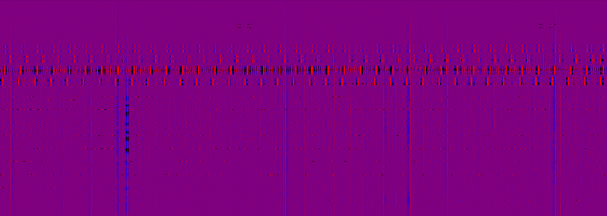
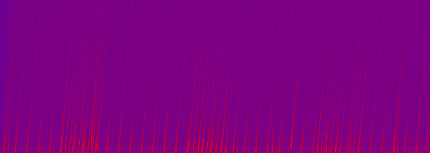

### DESCRIPTION

This is a minimal rf_pipelines run which incoherently dedisperses a GBNCC data
file in PSRFITS format.  It includes simple detrending, but no RFI removal, 
so the output is a mess!


### INSTRUCTIONS FOR RUNNING

First you'll need to generate the bonsai config hdf5 file from the bonsai text file.
(This is a temporary workaround for a currently-unimplemented feature in bonsai: on-the-fly
estimation of trigger variances.)
```
    bonsai-mkweight bonsai_config.txt bonsai_config.hdf5
```
Then run the example:
```
   ./example2-gbncc.py
```
This will generate a bunch of waterfall plots plus a file 'triggers.hdf5' containing
coarse-grained triggers.  The trigger file can be plotted with:
```
   bonsai-plot-triggers.py triggers.hdf5
```
After running the pipeline, you should see waterfall plots 'detrended_gbncc_0.png' and files 
'triggers_tree*.png showing' the dedispersion outputs.  There are 4 dedispersion output
files because the bonsai configuration file defines four trees to search different parts of
parameter space.  All the output files show a ton of RFI since there is no masking!
The github repo contains reference versions of some of these plots for comparison.




