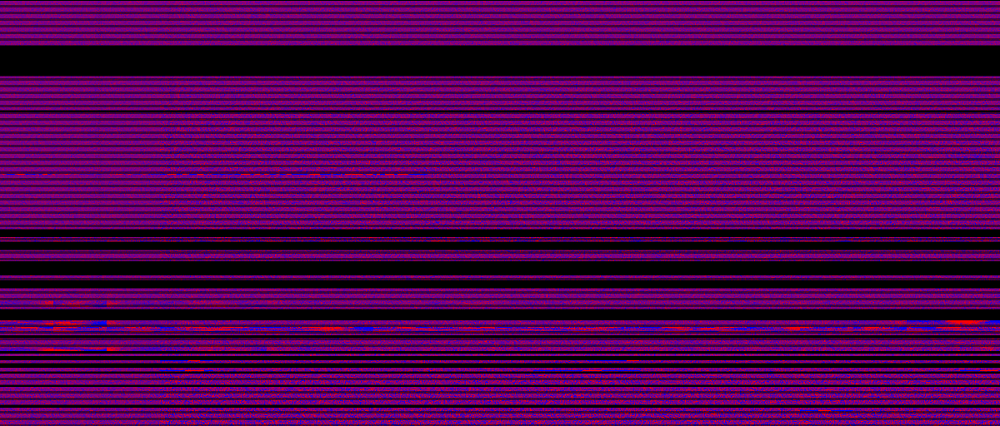

### DESCRIPTION

This is a minimal rf_pipelines run which incoherently dedisperses a few arbitrarily
chosen CHIME pathfinder data files.  It includes simple detrending, and simple RFI
removal via a bad channel mask.  There is still some unremoved RFI visible in the output,
so this processing is work in progress.


### INSTRUCTIONS FOR RUNNING

The filenames in example3-chime.py assume you're running on chimer.physics.mcgill.ca.

First you'll need to generate the bonsai config hdf5 file from the bonsai text file.
(This is a temporary workaround for a currently-unimplemented feature in bonsai: on-the-fly
estimation of trigger variances.)
```
    bonsai-mkweight bonsai_config.txt bonsai_config.hdf5
```
Then run the example:
```
   ./example3-gbncc.py
```
This will generate a bunch of waterfall plots plus files 'triggers.hdf5' containing
coarse-grained triggers.  The trigger file can be plotted with:
```
   bonsai-plot-triggers.py triggers.hdf5
```
After running the pipeline, you should see:
```
    raw_chime_*.png           waterfall plots of raw data
    detrended_chime_*.png     waterfall plots of detrended data
    triggers_*_tree*.png        output of the dedispersion transform
```
The waterfall plots have been split across 4 files as explained in the python script.
There are 12 trigger plots, because the same factor-of-4 splitting has been multiplied
by the three trees, which are defined in the bonsai config file to search different parts
of parameter space.

The github repo contains "reference" versions of some of these plots for comparison.

Current processing status: the noise source is removed by the legendre detrender!
Some RFI remains which will be taken care of soon by some detrend/clipper combination.





